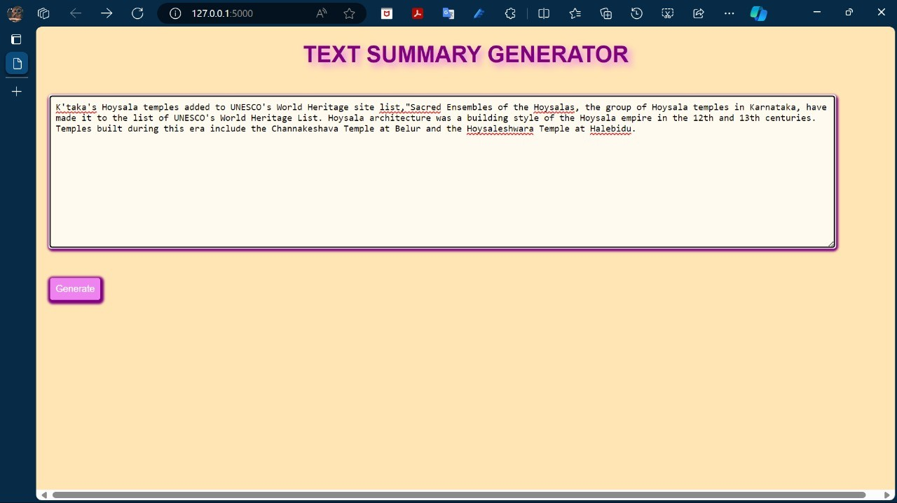
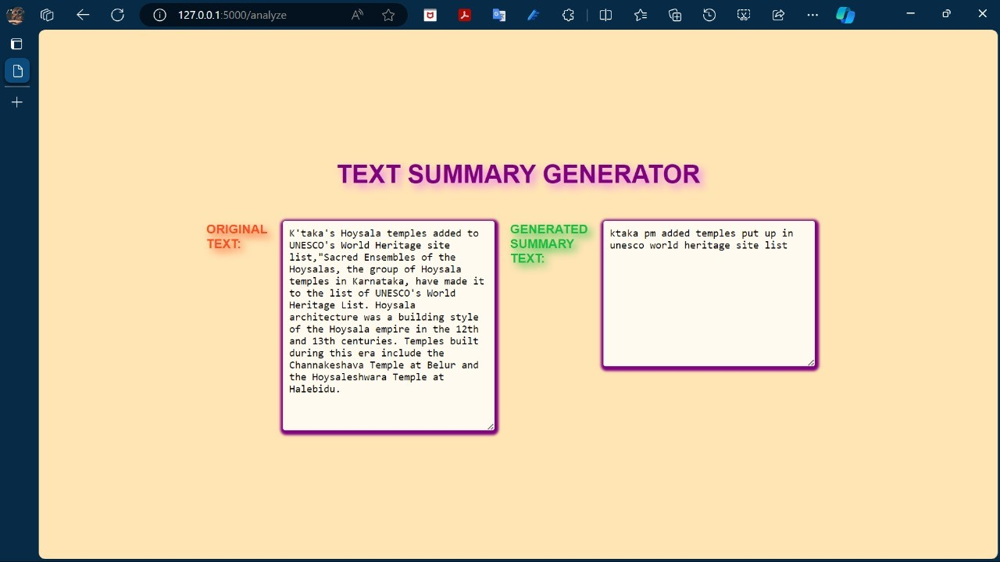

# News Headline Generator
**BSc Final Year Project – Computer Science (2023-2024)**

This repository contains my B.Sc. final-year project, developed to study and understand Transformer-based sequence-to-sequence models for abstractive text summarization.
Given a news article as input, the system generates a concise headline using a custom Transformer architecture implemented in TensorFlow.

## Project Motivation
Manually writing headlines for large volumes of news articles is time-consuming.
This project explores how **deep learning and NLP** can be used to automatically generate meaningful headlines from article text.
It emphasizes **conceptual understanding and end-to-end workflow learning**, rather than production-level optimization or benchmarking.

## Approach & Model
* Problem Type: **Text Summarization (Abstractive)**
* Model Architecture: **Transformer (Sequence-to-Sequence)**
* Learning Type: **Supervised Learning**
* Input: Full news article text
* Output: Generated headline
  
The model is trained on article–headline pairs to learn semantic relationships between long-form text and short summaries.

## Dataset
* The original public dataset contained a large number of news articles.
* **Only a small sample (first 100 rows)** is included in this repository due to GitHub file size limits.
* The dataset is used strictly for **academic and learning purposes**.

## Technologies Used
* Python
* Natural Language Processing (NLP)
* Transformer Models
* Flask (for web interface)
* Jupyter Notebook

## Framework Version Note
This project was developed during **2023–2024** using the TensorFlow/Keras APIs available at that time.  
Some implementation patterns used in this repository may be **superseded or deprecated in newer framework versions**.
The codebase is preserved in its original form to reflect the learning context during the project period.

## Workflow
1. News articles are preprocessed and tokenized
2. Transformer model is trained on article–headline pairs
3. Tokenizer and trained model is saved for inference
4. Flask app loads the tokenizer and model logic
5. User inputs article text and receives generated headline

## Application Demo
### Input Page

### Generated Summary Output

## Limitations & Future Work
* Model training was performed on a limited dataset
* Inference pipeline is simplified and demonstration-focused
* Greedy decoding is used instead of advanced decoding strategies
* Standard summarization metrics (e.g., ROUGE) are not included
* Deployment scalability and optimization are not addressed

## Academic Note
This project was developed as part of a **BSc Computer Science final-year project (2023-24)**.
The emphasis is on understanding **NLP concepts, Transformer models, and end-to-end ML workflow**.

## Privacy Notice
All personal, institutional, and academic identifiers have been **intentionally excluded** from this repository.
